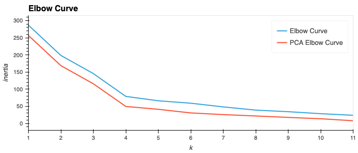

# CryptoClustering
- Module 19 Challenge
- Steph Abegg

In this challenge, you'll use your knowledge of Python and unsupervised learning to predict if cryptocurrencies are affected by 24-hour or 7-day price changes.

For this module’s Challenge, you will create a machine learning model that groups cryptocurrencies. The purpose will be to assemble investment portfolios that are based on the profitability of those cryptocurrencies.

This challenge demonstrates the usage of unsupervised learning with k-means clustering.

Using the provided data on Crypto Currencies, containing 7 features, I explored clustering the data. The analysis, plots, and code can be found in Crypto_Clustering.ipynb

## Steps

First, I normalized the data using StandardScaler() from scikit-learn.
Using this data, I then used the elbow method to find the best value for k.
From the elbow method line chart, I determined that the best value for k is 4.
I then fit the data with a k-means model to cluster the different crypto currencies into 4 groups then plotted the groups in a scatter plot.
I then used Principal Component Analysis (PCA) to reduce the features down to 3.
The explained variance of these three features was 89%.
I repeated the process of using the elbow method and fitting the data with a k-means model.
Using PCA and the elbow method, the best value of k was again determined to be 4, leading to the conclusion that PCA with 3 features was appropriate for this data set.
Finally, I compared the the elbow curves and the scatter plots before and after PCA. Images are shown below.
Overall, using PCA made the outliers more obvious, however, it does not make clusters 0 and 3 appear more distinct, at least with the two dimensions shown.

## Plots

